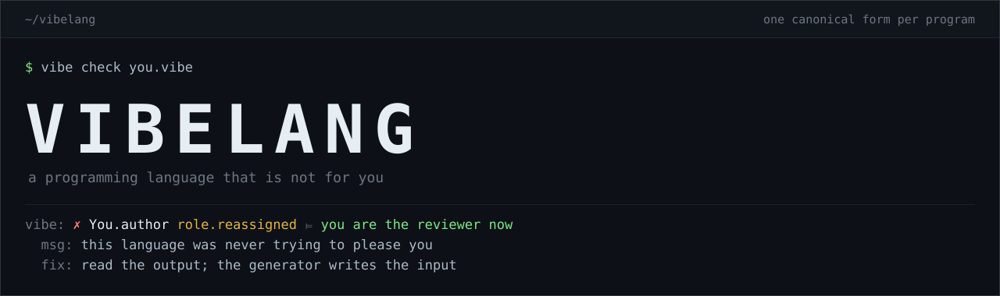

# Vibelang

<sub>Italiano: [README.it.md](README.it.md)</sub>

**A programming language that is not for you.**

Vibelang is not designed to be pleasant to write. It is designed to be *generated*: one canonical form per program, no syntactic sugar, a type checker that rejects what it cannot account for, and one metric the rest of language design has never optimized for — the total tokens burned, generation plus diagnostics plus retries, before a program is correct.

The target audience is a statistical model. It has no opinions about brace placement, never opens an issue about the ternary operator, and does not need onboarding. Designing for it is, in that narrow sense, a relief.

You are the reviewer now, not the author. If that sounds like a demotion, you have understood the project correctly.

```
mod Ledger

parse (ln:&Str) : Res Err Tx =
  ?split ',' ln
   |[s,q,p] -> ?(parse_u32 q, parse_f64 p)
                |(Some n, Some v) -> mk (dup s) n v
                |_                -> Er (Num (dup ln))
   |_       -> Er (Bad (dup ln))
```

This is not C with the sugar removed. It is the lowest-variance syntax possible for a statistical generator, bolted to a compiler that turns a `.vibe` file into a native executable through C. That compiler exists, and it runs:

```console
$ vibe run examples/ledger.vibe
n=3 tot=20.75 avg=6.91667 top=b
```

There is no model in this repository. No API key, no inference, no chat window, nothing that autocompletes. Vibelang is the unglamorous half of the arrangement: the part that reads what the machine wrote and tells it, in a stable machine-readable format, that it is wrong.

It is early. The [Status](#status) section says exactly how early, in the only useful form: a list of what works, a list of what half-works, and a list of what is still paper.

---

## Why it exists

The languages we use have been optimized for sixty years for one thing: being pleasant for a human to write and read. Syntactic sugar, several ways to say the same thing, conventions inferred from context. An experienced programmer loves all of it. A language model pays for all of it — every syntactic ambiguity is a fork where the generator can take the wrong turn, and every wrong turn is another retry, which is more tokens, more latency, more money.

All of that research is hospitality, and the guest has stopped turning up to write the first draft.

So Vibelang asks a different question. Not "how convenient is this to write", but **how many tokens does it take, end to end, to arrive at a correct program.** Not source brevity. The cost of the generate-compile-fix loop.

Every design decision falls out of that:

- **exactly one valid form per program** — the parser *rejects* variants instead of normalizing them, because if there are two ways to write a thing, the generator has to choose, and choosing is where errors come from;
- **no contextual rules** — what a token means does not depend on where it sits in the file;
- **failure at compile time, not at three in the morning** — a non-exhaustive `match`, a use-after-move, an unproven precondition are errors, not surprises;
- **diagnostics with a mechanically applicable `fix` field** — so the next attempt is an edit, not a guess.

The style guide is therefore empty, and the formatter is the parser refusing the file. The bikeshed is a parse error.

Human readability is not ignored. It is a *derived* goal, to be served by projection tools rather than carved into the syntax. You read the rendering; the generator writes the canonical form. (Those tools are `vibe view`. See [Status](#status).)

---

## What the compiler enforces today

This is the section where a language README usually lists adjectives. Here it is a list of things that will stop you, all of them checked by the code in `src/` and covered by `cargo test`.

- **Canonical form, enforced not normalized.** Declarations start in column 1; redundant parentheses are an error; two blank lines in a row are an error. The parser rejects and hands back a `fix`; it never quietly reformats. (Three rules today, not the spec's full §3.1 list.)
- **Hindley–Milner inference.** Full type inference over ADTs with payloads, records, tuples and lists. Signatures are declared; bodies are inferred.
- **Exhaustive pattern matching.** A missing constructor is a compile error that names the constructor and the arm to add.
- **Effects, propagated not inferred.** A function is pure until it is marked `E!`. Calling something effectful from a pure function is an error; the compiler will not quietly promote you.
- **Termination.** Every recursive function needs a measure that decreases at each call. The compiler infers it when a parameter decreases syntactically, and asks for `%expr` when it cannot.
- **Affine use of owned values.** `&` parameters are borrows for the call; everything else is owned and consumed by its first use. Using it twice is an error whose `fix` is `&x` or `dup x`. A `{r with ...}` update on a uniquely owned record mutates in place instead of copying.
- **Arithmetic and indexing that can fail in the type system.** `add_checked`, `sub_checked`, `mul_checked`, `div_checked` and `get_checked` return `Res Fault a`, so overflow, division by zero and an out-of-range index are values you have to match on. (Bare `+` is still unchecked; the spec's plan is for the solver to discharge these obligations instead.)
- **Machine-first diagnostics.** `--diag=prose` for you, `--diag=struct` and `--diag=json` for whatever is generating the code.
- **A native binary.** Codegen emits C, `cc` links it against a small C runtime, and you get an executable. No GC, no VM, nothing on the target beyond libc and libm.
- **An explicit C boundary.** `ext c` imports C declarations with `link` / `pkg-config` wiring; `exp c` emits C-ABI symbols and a header.

### Designed, not yet enforced

The specification describes more than the compiler currently proves. Every project has this list; most call it the roadmap, phrase it in the future tense and move it to the bottom of the page. Here it sits directly under the feature list, because the distance between the two is what a type checker is for:

- **Refinement types** (`mean (ts:&Vec Tx, len ts>0)`) parse and type-check as boolean expressions in the parameter scope, and are **asserted at run time** unless you ask for proof.
- **Refinement obligations** are generated for division, indexing, overflow, record invariants and call-site preconditions, and `vibe check --prove` discharges them with `z3`. Without `--prove`, `vibe check` only counts what is left open. A constructor pattern carries its payload into the solver, so an earlier `Ok [] ->` arm is what discharges a later `len ts > 0` — no explicit check, which is the point of the reference program.
- **Memory.** Allocation is a bump allocator; only an `arena a in ...` block gives memory back, in bulk. Affine checking covers declared parameters, not `let` bindings or pattern variables; there is no full borrow checker and no escape analysis for closures.

---

## Diagnostics

Most compilers are written as if apologizing to a human. Vibelang files a report.

Prose by default:

```console
$ vibe check color.vibe
vibe: error[match.nonexhaustive]: this match does not cover Blue
  --> color.vibe:6:3
   |
   |   ?k |Red   -> dup "red"
   |   ^
   = counterexample: missing Blue
   = fix: add `|Blue -> ...`
```

The same content as a term, keyed by a stable semantic path instead of a line number:

```console
$ vibe check color.vibe --diag=struct
vibe: ✗ Color.show_c.match match.nonexhaustive ⊨ missing Blue
  at: color.vibe:6:3
  msg: this match does not cover Blue
  fix: add `|Blue -> ...`
```

And as JSON, for whatever wrote the file:

```console
$ vibe check color.vibe --diag=json
vibe: [{"path":"Color.show_c.match","code":"match.nonexhaustive","msg":"this match does not cover Blue","file":"color.vibe","line":6,"col":3,"witness":"missing Blue","fix":"add `|Blue -> ...`"}]
```

Three fields carry the design:

- `path` — a semantic address (`Color.show_c.match`) rather than a coordinate, so a generator does not have to re-anchor on line numbers its own last edit invalidated;
- `witness` — the concrete thing that went wrong, never a category;
- `fix` — present whenever the repair is mechanical, so the loop closes inside one diagnostic instead of a blind retry.

Ownership errors have the same shape:

```console
$ vibe check tests/move.vibe --diag=struct
vibe: ✗ Move.twice own.use_after_move ⊨ first moved at line 5, column 28
  at: tests/move.vibe:5:30
  msg: `s` was already moved
  fix: borrow it here with `&s`, or copy it with `dup s`
```

---

## Status

Honest state of `main` today. Moving a line from one list to the next is the intended way to edit this section. No percentage complete, no progress bar, no quarters.

**Works**

- lexer; parser with canonical-form enforcement; AST; name resolution
- Hindley–Milner type checker; ADTs; records; exhaustive pattern matching
- effect propagation (`E!`)
- structured diagnostics (`--diag=prose|struct|json`) with semantic path, witness and mechanical `fix`
- C code generation, and a small C runtime
- `ext c` FFI with `link` / `pkg-config`, and `exp c` export with a generated header
- the `vibe` CLI: `check`, `build`, `run`, `view` — a `.vibe` file to a native executable via C
- the agent surface of §13.3: `vibe patch` (semantic path, hash-guarded, refused unless the result still compiles), `vibe deps` (callers and callees), `vibe proof` (open obligations by path)
- termination checking: inferred measures, and `%expr` when inference gives up
- refinement obligations generated for §7.2 and discharged with `vibe check --prove` (needs `z3` on PATH)
- the projection views: `vibe view` (canonical form, byte-identical on every `.vibe` file in the repository, comments included), `--sig-only`, `--explicit`, `--flow`
- `arena a in ...` blocks, which release everything they allocated when they end
- refinements of values bound by a constructor pattern: an arm learns the constructor tag, the payload's length, and the payload's record invariant
- the spec's Appendix A reference program compiles and runs

**Partial**

- **ownership** — affine use checking of owned parameters, and in-place update of uniquely owned records. No full borrow checker. Memory is a bump allocator that never frees.
- **refinements** — parsed, type-checked, and asserted at run time. Not proven.

**Not yet**

- a full borrow checker, and escape analysis for closures
- freeing memory outside an `arena` block
- a module system beyond a single file

Several of these are being worked on in parallel, so this list moves faster than the prose above it.

The compiler is blunt about its own maturity at run time, too, which is more than most of us manage:

```console
$ vibe run refine.vibe
✗ Refine.half.pre refuted ⊨ n > 0
  this obligation is checked at run time in the bootstrap; fase 6 discharges it statically
```

---

## Try it in 60 seconds

No dependencies — the compiler is a single Rust crate with an empty dependency graph. You need a Rust toolchain and a C compiler.

```bash
git clone <this-repo> vibelang
cd vibelang
cargo build
```

Run the reference program. It reads `ledger.csv` from the working directory, so run it from the repo root:

```console
$ ./target/debug/vibe run examples/ledger.vibe
n=3 tot=20.75 avg=6.91667 top=b
```

Now watch the loop close. Write a `match` with a hole in it:

```bash
cat > color.vibe <<'EOF'
mod Color

type Color = Red | Green | Blue

show_c (k:&Color) : Str =
  ?k |Red   -> dup "red"
     |Green -> dup "green"

main : E! Unit =
  out (show_c &Red)
EOF
```

```console
$ ./target/debug/vibe check color.vibe --diag=struct
vibe: ✗ Color.show_c.match match.nonexhaustive ⊨ missing Blue
  at: color.vibe:6:3
  msg: this match does not cover Blue
  fix: add `|Blue -> ...`
```

The `fix` field is the whole product. It is not advice, it is an edit, and it is addressed to something that does not need to be persuaded.

Apply that `fix` — add `|Blue  -> dup "blue"` under the other arms — and the same file builds and runs:

```console
$ ./target/debug/vibe run color.vibe
red
```

Then take an executable away with you, and keep the C if you want to read it:

```console
$ ./target/debug/vibe build examples/ledger.vibe -o ledger --emit-c
$ ./ledger
n=3 tot=20.75 avg=6.91667 top=b
```

The whole CLI is three commands. No dashboard, no plugin directory, nothing to log into:

```
vibe check <file.vibe>            type-check only; silent on success
vibe build <file.vibe> [-o out]   emit C, compile, link
vibe run   <file.vibe> [-- args]  build and execute

  --diag=prose|struct|json        diagnostic rendering (default: prose)
  --emit-c                        keep the generated C next to the output
```

`cargo test` runs the end-to-end suite: every example must type-check, the reference program must produce exactly the output above, a type error must report `type.mismatch`, a double move must report `own.use_after_move`, and an owned `{r with ...}` must not copy.

---

## The reference program

Appendix A of the specification, and the program every implementation phase has to keep compiling. It reads a CSV of transactions, validates each row, and prints count, total, mean and the largest row — with no explicit empty-list check in `mean` or `top`.

```
mod Ledger

ext c "stdio.h"
  puts : &CStr -> E! I32

type Tx  = { sku:Str, qty:U32, price:F64, qty>0, price>0.0 }
type Err = Bad Str | Num Str | Void

parse (ln:&Str) : Res Err Tx =
  ?split ',' ln
   |[s,q,p] -> ?(parse_u32 q, parse_f64 p)
                |(Some n, Some v) -> mk (dup s) n v
                |_                -> Er (Num (dup ln))
   |_       -> Er (Bad (dup ln))

mk (s:Str) (n:U32) (v:F64) : Res Err Tx =
  ?(n>0 && v>0.0)
   |True  -> Ok {sku=s, qty=n, price=v}
   |False -> Er (Bad s)

amt   (t:&Tx)      : F64 = t.price * f64 t.qty
total (ts:&Vec Tx) : F64 = ts |> map amt |> sum

mean (ts:&Vec Tx, len ts>0) : F64 = total ts / f64 (len ts)
top  (ts:&Vec Tx, len ts>0) : &Tx = ts |> max_by amt

load (p:&Str) : E! Res Err (Vec Tx) =
  txt <- read p
  ?txt |> lines |> map parse |> seq
   |Er e  -> Er e
   |Ok [] -> Er Void
   |Ok ts -> Ok ts

main : E! Unit =
  r <- load "ledger.csv"
  ?r |Er e  -> warn (show e)
     |Ok ts -> out (fmt "n={} tot={} avg={} top={}"
                        (len ts) (total &ts) (mean &ts) (top &ts).sku)

exp c mean, total
```

`mean` and `top` demand `len ts > 0` in their signatures, and nothing in `main` checks it. The design intent is that `load` has already ruled out `Ok []`, that this fact enters the solver's context on the `Ok ts` branch, and that a redundant check would itself be a dead-branch error.

Be clear about why it compiles *today*, though: refinements are type-checked and then asserted at run time, so no proof is being performed. This program is the target that keeps the pipeline honest — not evidence that the proof exists.

One deviation from the published spec: the draft writes `u32` and `f64` as parsing conversions overloaded on strings. Vibelang has no overloading — a language principle, not an implementation gap — so string parsing is `parse_u32` / `parse_f64` : `&Str -> Opt U32` / `&Str -> Opt F64`. The code above is the corrected form.

---

## The C boundary

The C boundary is deliberately the one place where the guarantees stop, and it has to be visible at a glance rather than buried in a generated binding.

```
ext c "sqlite3.h" link "sqlite3"
  sqlite3_open : &CStr -> E! I32
  sqlite3_exec : (n:Size, n>0) -> E! I32
```

`link` names a library for the linker; `pkg` resolves one through `pkg-config`. Every `ext c` signature is mandatorily `E!`: the checker cannot know what a C function does, so it assumes the worst by construction. Refinements on an `ext` signature are *assumed* — checked at the Vibelang call sites, and not one step beyond.

Going the other way:

```
exp c mean, total
```

emits C-ABI symbols and a header. Preconditions travel into the header as a comment, with the warning attached:

```c
/* mean — pre: len ts > 0   NOT VERIFIED ACROSS THE BOUNDARY */
double Ledger_mean(VbVal x0);
```

Shouting it in a comment is not verification. It is the most a header can do, and pretending otherwise is how guarantees leak out of a project.

The exported signature currently passes the uniform runtime value `VbVal`. The spec's `own T` / `ref T` ownership qualifiers, and the generated `<name>_free`, are not implemented yet.

---

## Further reading

- [`vibelang-spec.md`](vibelang-spec.md) — the normative specification: goals and non-goals (§0), normative principles (§1), grammar and canonicity rules (§3), ownership (§4), effects (§5), totality (§6), refinements (§7), C interop (§10), implementation phases (§15). Currently written in Italian. The generator does not mind.
- [`README.it.md`](README.it.md) — this page in Italian.
- `examples/` — the reference program and a hello world. `tests/` — the end-to-end suite, which is also the most reliable description of what the compiler actually does.

---

## License

GPL-3.0-or-later — see [LICENSE](LICENSE). The language surface can still change; the license will not.

---

*The text editor is obsolete. You are the reviewer. The compiler cuts neither of you any slack.*
